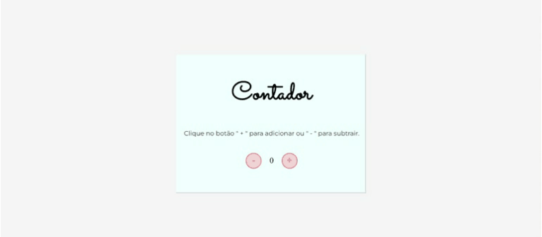

 

    <a href="https://github.com/Fernanda1701/contador/blob/main/README.md">☆ Português Brasileiro</a>
    <a href="https://github.com/Fernanda1701/contador/blob/main/README.eng.md">☆ English ☆</a> 

<h1 align="center">
    <a href="https://fernanda1701.github.io/contador/">Contador 🧮</a>
</h1>

Simple counter made in JavaScript

<h2 align="center">

</h2>

## 💎 About

The project was developed for fixing basic JavaScript knowledge, 
the <b>Contador</b> is a simple counter, initialized at zero, where clicking the "+" (plus) button <b><i>increments</b></i> the value and clicking the "-" (minus) button <b><i>decrements</b></i> the value. Below, we have the functionality:

<h3 align="center">Counter</h3>

  

To check out the <b>Contador 🧮</b> ➞ <a href="https://fernanda1701.github.io/contador/">Click here!</a>

## 🛠 Technologies
 
- [HTML5](https://developer.mozilla.org/en-US/docs/Glossary/HTML5)
- [CSS3](https://devdocs.io/css/)
- [JavaScript](https://developer.mozilla.org/pt-BR/docs/Web/JavaScript)
- Code versioning on [GitHub](https://github.com/)

## 💻 IDE

IDE used: [VScode](https://code.visualstudio.com/)

## Author:

<a href="https://github.com/Fernanda1701">
 
  
 <b>Fernanda Nascimento</b></a> 

Contact Me ✉️:

