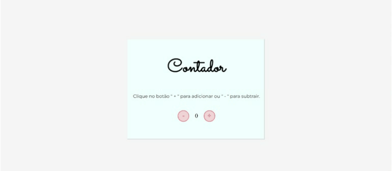

    <a href="">☆ Português Brasileiro</a>
    <a href="">☆ English ☆</a> 

<h1 align="center">
    <a href="https://fernanda1701.github.io/contador/">Contador 🧮</a>
</h1>

Contador simples feito em JavaScript

<h2 align="center">

</h2>

## 💎 Sobre

O projeto foi desenvolvido para a fixação de conhecimentos básicos em JavaScript, 
o <b>Contador</b> é um contador simples, inicializado no zero, onde clicando no botão "+" (mais) o valor é <b><i>incrementado</b></i> e clicando no botão "-" (menos) o valor é <b><i>decrementado</b></i>. 
Abaixo, temos a funcionalidade:

<h3 align="center">Contador</h3>

  

Para conferir a webpage do <b>Contador 🧮</b> ➞ <a href="https://fernanda1701.github.io/contador/">Clique aqui!</a>

## 🛠 Tecnologias
 
- [HTML5](https://developer.mozilla.org/en-US/docs/Glossary/HTML5)
- [CSS3](https://devdocs.io/css/)
- [JavaScript](https://developer.mozilla.org/pt-BR/docs/Web/JavaScript)
- Versionamento de código no [GitHub](https://github.com/)

## 💻 IDE

IDE utilizada: [VScode](https://code.visualstudio.com/)

## Autor:

<a href="https://github.com/Fernanda1701">
 
  
 <b>Fernanda Nascimento</b></a> 

Entre em contato ✉️:

